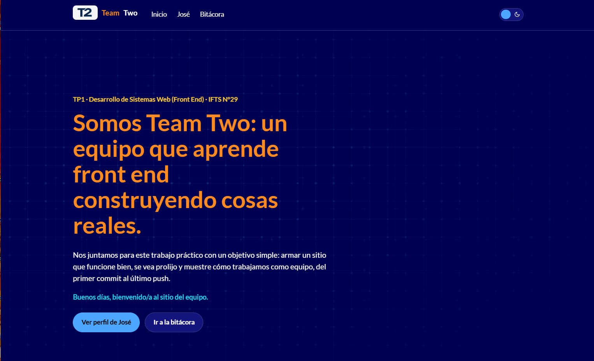
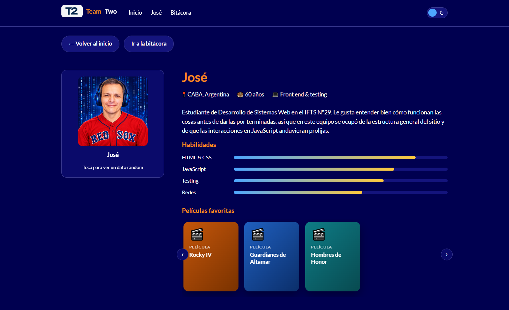
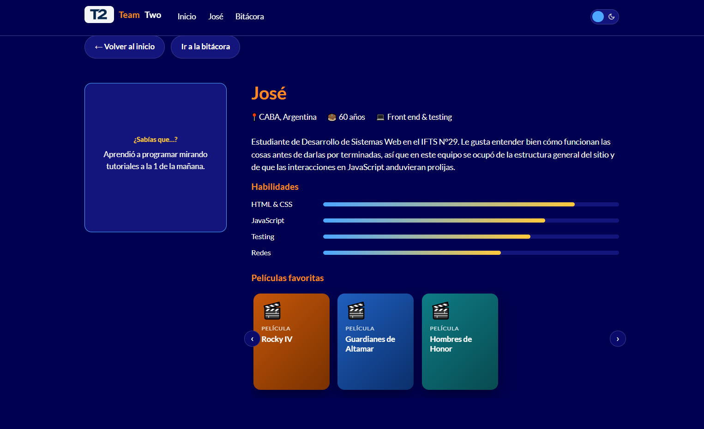
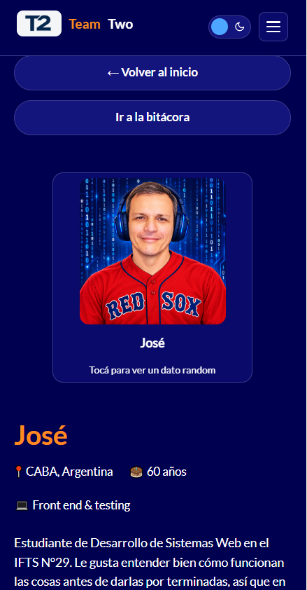

# Team Two — TP1: Proyecto web en equipo

Sitio del TP1 de **Desarrollo de Sistemas Web (Front End)**, IFTS N°29, 2do cuatrimestre 2026. Portada con el propósito del equipo, un perfil individual, navegación interna y una bitácora del proceso. Hecho solo con **HTML, CSS y JavaScript** (más Google Fonts).

## Integrantes

| Nombre | GitHub |
|---|---|
| José Luis Galvis | [JoseLuisGalvis](https://github.com/JoseLuisGalvis) · [Portafolio](https://dev-portfolio-2025.vercel.app/) |

> El equipo quedó reducido a una persona, por eso hay una única tarjeta y un único perfil (ver la bitácora).

## Tecnologías utilizadas

- HTML5 semántico
- CSS3 (variables, Grid, Flexbox, media queries, transiciones)
- JavaScript vanilla (DOM, eventos, `Date`, `Math.random`, `data-*`, Canvas API, IntersectionObserver)
- Google Fonts (Lato)
- Git/GitHub y Vercel
- Pruebas de layout con Playwright (solo verificación local, no forma parte del sitio)

## Estructura de archivos

```
/
├── index.html        → portada
├── jose.html         → perfil individual
├── bitacora.html     → bitácora de proceso
├── css/style.css     → estilos y temas claro/oscuro
├── js/
│   ├── main.js            → saludo dinámico de la portada
│   ├── hero-bg.js         → fondo animado del hero (canvas)
│   ├── nav.js             → tema claro/oscuro + menú hamburguesa
│   ├── reveal.js          → animaciones al hacer scroll
│   ├── perfil.js          → flip card + barras de habilidades
│   └── media-carousel.js  → carrusel de películas/discos + tilt 3D
├── img/
│   ├── logo-t2.png
│   └── jose-luis.jpg
└── capturas/         → capturas de pantalla usadas en este README
```

## Guía de estilos

**Paleta (hexadecimal)**

| Uso | Modo light (por defecto) | Modo dark |
|---|---|---|
| Fondo | `#000050` | `#000000` |
| Superficie (tarjetas) | `#0a0a6a` | `#0d0d0d` |
| Superficie alternativa | `#14147d` | `#1a1a1a` |
| Borde | `#3a3a90` | `#333333` |
| Títulos | `#ff8a1f` (naranja) | `#ff8a1f` (naranja) |
| Texto y links | `#ffffff` | `#ffffff` |
| Color de apoyo 1 — azul cielo | `#4da6ff` | `#4da6ff` |
| Color de apoyo 2 — dorado | `#ffc93c` | `#ffc93c` |
| Color de apoyo 3 — cian | `#22d3ee` | `#22d3ee` |

El sitio **arranca en modo light** (fondo `#000050`); el switch sol/luna del menú cambia a dark y recuerda la elección.

**Tipografía:** [Lato](https://fonts.google.com/specimen/Lato) (400, 700, 900) para títulos y cuerpo.

**Iconografía:** emojis nativos (📍 🎂 💻 🎬 💿), íconos SVG de sol/luna en el selector de tema y el logo "T2" (`img/logo-t2.png`).

## Funciones de JavaScript

### Portada (`js/main.js` y `js/hero-bg.js`)

- **Saludo dinámico:** toma la hora del visitante con `new Date().getHours()` y muestra "Buenos días", "Buenas tardes" o "Buenas noches".
- **Fondo animado del hero:** un `<canvas>` dibuja dos capas de cuadrícula que se mueven a distinta velocidad (efecto parallax) con puntos que laten. Toma el color de `--accent` y respeta `prefers-reduced-motion`.



### Perfil (`js/perfil.js` y `js/media-carousel.js`)

- **Flip card con dato aleatorio:** al hacer click o presionar Enter/Espacio sobre la tarjeta, gira 180° (`rotateY`) y muestra un dato curioso elegido con `Math.random()` desde `data-facts`.
- **Barras de habilidades animadas:** al cargar, pasan de 0% al nivel real (`data-level`).
- **Carrusel de películas y discos:** flechas con `scrollBy()` y efecto tilt 3D que sigue al mouse (desactivado en pantallas táctiles). En todas las tarjetas el ícono y el título quedan a la misma altura.





### En todas las páginas (`js/nav.js`, `js/reveal.js`)

- **Tema claro/oscuro:** cambia `data-theme` y guarda la elección en `localStorage`.
- **Menú hamburguesa** hasta 900 px, con `aria-expanded`.
- **Reveal al scrollear** con `IntersectionObserver`.

## Diseño adaptable

- **1200 px:** se reduce el ancho máximo del contenedor.
- **900 px:** el perfil pasa a una columna y aparece el menú hamburguesa.
- **400 px:** la tarjeta ocupa todo el ancho, los botones ocupan el ancho completo y se reduce el título.

Se verificó con una prueba automática que no hay desborde horizontal en ninguna página a 400, 900, 1200 y 1440 px.



## Uso de IA y autoría

- **Aplicaciones y modelos:**
  - **Claude** (Anthropic), modelo Claude Sonnet 5: código, estructura del sitio, depuración y redacción del README.
  - **ChatGPT** (OpenAI): generación de la imagen de perfil, con el modelo **GPT-5.6 Luna**.
- **Plan:** tanto Claude como ChatGPT se usaron con el plan **gratuito**.
- **Experiencia previa con IA:** dos años de uso.
- **Qué asistió la IA:** estructura HTML de las páginas, hoja de estilos (`css/style.css`), scripts de JavaScript, la actualización de paleta, tipografía y perfil, y la redacción del README.
- **Imagen de perfil:** `img/jose-luis.jpg`, imagen cuadrada de José **generada con IA (ChatGPT)**. **Criterio del prompt:** se pidió una imagen de José, agradable, con auriculares azul marino estilo gamer, camiseta roja de los Boston Red Sox con letras azules y borde blanco, y un fondo de código binario sobre `#000050` con números en azul claro y blanco, para que combine con la paleta del sitio. El logo "T2" lo aportó el equipo.
- **Privacidad:** se usa una sola imagen de perfil, sin datos personales sensibles; el resto de la información es la que José decidió publicar.
- **Qué revisó y adaptó con criterio propio:** José creó el proyecto, revisó cada sección y lo testeó para identificar defectos y corregirlos. También eligió la paleta y la tipografía, y definió sus películas y discos favoritos, sus datos personales y el enlace a su portafolio.

## Publicación

- **Repositorio:** https://github.com/JoseLuisGalvis/desarrollo_web_TP1_2026
- **Sitio en Vercel:** https://desarrollo-web-tp-1-2026.vercel.app

## Evolución

Este README se ampliará en los próximos trabajos prácticos con cambios de estructura, nuevas funciones de JavaScript y mejoras de diseño.
